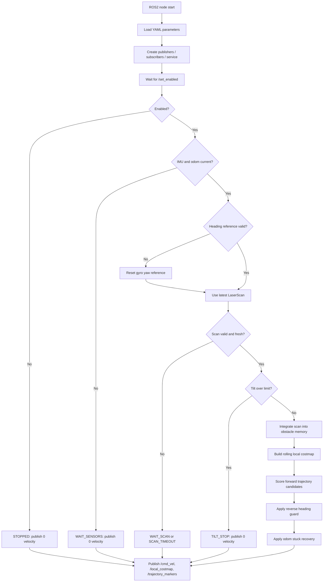
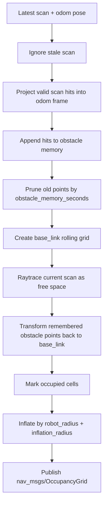
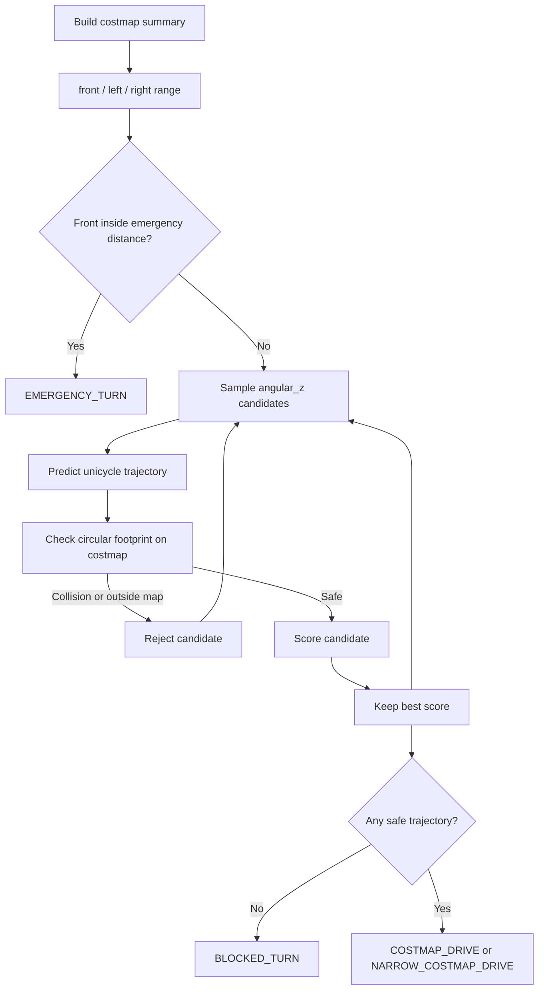

# Code Flow

이 문서는 [src/costmap_drive_node.cpp](src/costmap_drive_node.cpp)의 동작 흐름을 설명합니다. 이 노드는 기존 `gap_drive`처럼 `/scan`, `/imu`, `/odom`으로 직접 `/cmd_vel`을 만들지만, 핵심 판단은 LaserScan 한 프레임의 gap 후보가 아니라 짧게 누적한 local costmap과 후보 궤적 점수화로 수행합니다.

## 전체 구조

## 입력과 상태 저장

1. `scan_callback`

   `/scan`의 최신 `LaserScan`과 수신 시간을 저장합니다. 제어 timer에서는 `lost_scan_timeout_seconds`보다 오래된 scan을 사용하지 않습니다.

2. `imu_callback`

   `/imu` orientation quaternion으로 roll/pitch를 계산해 전복 정지에 사용합니다. `angular_velocity.z`는 gyro yaw로 적분하며, start 시점에 기준 yaw를 0도로 reset합니다.

3. `odom_callback`

   `/odom` pose에서 로봇의 `x`, `y`, `yaw`를 저장합니다. scan obstacle point를 odom frame에 짧게 누적하고, 전진 명령이 있는데 위치 변화가 거의 없을 때 stuck 복구를 판단합니다.

4. `set_enabled_callback`

   `/turtlebot_autonomous_costmap_drive/set_enabled` 서비스로 주행을 켜고 끕니다. stop 요청이 들어오면 obstacle memory와 recovery 상태를 비우고 0속도를 publish합니다.

## Costmap 생성 흐름

Costmap은 `base_link` 기준 rolling grid입니다. 현재 scan ray는 free space를 빠르게 갱신하고, obstacle memory는 짧은 시간 동안 장애물 끝점과 벽 구조를 유지합니다. 그래서 작은 장애물 섬, 대각 벽, C자형 구조처럼 한 프레임 scan만으로 애매한 상황에서 더 안정적인 판단 근거를 가집니다.

## 후보 궤적 선택

각 후보는 `max_angular_speed` 범위 안에서 샘플링한 `angular_z`와 감속된 `linear_x`를 갖습니다. 후보 궤적은 `trajectory_horizon_s` 동안 `trajectory_dt_s` 간격으로 예측하고, 로봇 반지름 원형 footprint가 lethal 또는 높은 inflation cost를 밟으면 reject합니다.

점수는 아래 항목을 합쳐 계산합니다.

- 앞으로 진행한 거리 보상
- obstacle/inflation cost 감점
- unknown cell 비율 감점
- 큰 회전량 감점
- 직전 명령과의 급격한 변화 감점
- 좌우로 크게 벗어나는 lateral drift 감점
- start heading 기준에서 크게 벗어나는 heading 감점

## 주행 모드

- `STOPPED`: 서비스 start 전 또는 stop 요청 후 0속도입니다.
- `WAIT_SENSORS`: IMU 또는 odom이 없거나 timeout입니다.
- `WAIT_SCAN`: 아직 LiDAR scan을 받지 못했습니다.
- `SCAN_TIMEOUT`: 마지막 scan이 너무 오래되었습니다.
- `TILT_STOP`: IMU roll/pitch가 `tilt_stop_deg`를 넘었습니다.
- `COSTMAP_DRIVE`: local costmap에서 가장 낮은 cost의 전진 궤적을 따라갑니다.
- `NARROW_COSTMAP_DRIVE`: 양쪽 벽이 가깝지만 inflation 사이 중앙 corridor가 통과 가능해서 저속으로 진행합니다.
- `BLOCKED_TURN`: 안전한 전진 궤적이 없어 좌우 중 더 여유 있는 방향으로 제자리 회전합니다.
- `EMERGENCY_TURN`: 전방 장애물이 매우 가까워 즉시 전진을 멈추고 회전합니다.
- `REVERSE_WARN`: 기준 heading 반대 방향으로 전진 중이지만 아직 hold 시간 전입니다.
- `REVERSE_RECOVERY`: 기준 heading 쪽으로 제자리 회전합니다.
- `STUCK_BACKUP`: 전진 명령이 있는데 odom상 진행이 없어 짧게 후진합니다.
- `STUCK_TURN`: 후진 후 더 여유 있는 방향으로 제자리 회전합니다.

## 덮어쓰기 우선순위

`compute_costmap_drive_output`이 만든 명령은 최종 명령이 아닙니다. 기존 `gap_drive`처럼 안전장치가 뒤에서 명령을 덮어씁니다.

1. Costmap 기본 로직이 `COSTMAP_DRIVE`, `NARROW_COSTMAP_DRIVE`, `BLOCKED_TURN`, `EMERGENCY_TURN` 중 하나를 만듭니다.
2. `apply_reverse_guard`가 필요하면 `REVERSE_RECOVERY`로 선속도 0, 회전 명령을 덮어씁니다.
3. `apply_stuck_recovery`가 필요하면 `STUCK_BACKUP` 또는 `STUCK_TURN`으로 다시 덮어씁니다.

따라서 로그의 최종 mode는 마지막 안전장치 기준입니다. 예를 들어 costmap상 안전한 궤적이 있어도 odom이 움직이지 않으면 최종 mode는 `STUCK_BACKUP`이 됩니다.

## RViz와 로그 확인 포인트

- `/costmap_drive/local_costmap`: local occupancy grid입니다. 회색/검은 장애물과 inflation이 너무 커서 좁은 통로를 막으면 `inflation_radius_m` 또는 `robot_radius_m`을 낮춥니다.
- `/costmap_drive/trajectory_markers`: 최종 선택된 궤적입니다. 궤적이 벽 쪽으로 붙으면 `cost_obstacle_weight`, `cost_lateral_weight`, `cost_turn_weight`를 조정합니다.
- 터미널 로그의 `traj=evaluated/rejected`: RViz marker가 아니라 `report_timer_callback`에서 찍는 숫자입니다. 후보 대부분이 reject되면 costmap이 너무 보수적이거나 grid 범위가 너무 좁은 상태입니다.

즉 RViz에서는 map과 최종 선택 궤적을 보고, 후보 개수와 reject 개수는 노드 로그에서 확인합니다. 현재 코드는 모든 후보 궤적을 RViz로 그리지 않고, 최종 선택된 궤적만 `/costmap_drive/trajectory_markers`로 발행합니다.
