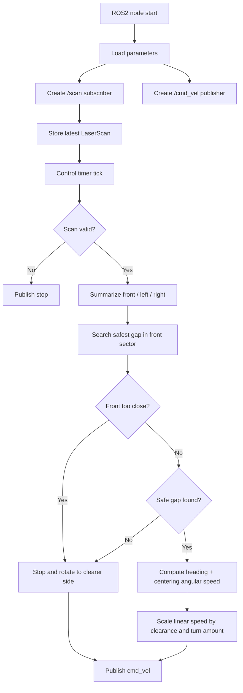

# Code Flow

이 문서는 [src/gap_drive_node.cpp](src/gap_drive_node.cpp)의 동작 흐름을 설명합니다.

## 전체 구조

## 콜백 흐름

1. `scan_callback`

   ROS2 `/scan` 토픽에서 최신 `LaserScan` 메시지를 받아 저장합니다. 오래된 scan을 쓰지 않도록 수신 시간도 같이 저장합니다.

2. `control_timer_callback`

   ROS2 timer가 `control_period_ms`마다 실행됩니다. scan이 없거나 너무 오래되면 정지 명령을 publish합니다.

3. `compute_drive_output`

   전방, 좌측, 우측 거리와 가장 좋은 빈 공간을 계산한 뒤 현재 주행 모드를 선택합니다.

4. `publish_velocity`

   ROS2 `/cmd_vel` 토픽으로 속도 명령을 publish합니다. 기본은 `Twist`이고, `cmd_vel_stamped`가 true이면 `TwistStamped`를 사용합니다.

## 주행 모드

- `WAIT_SCAN`: 아직 라이다 scan을 받지 못한 상태입니다.
- `SCAN_TIMEOUT`: 마지막 scan이 너무 오래되어 정지합니다.
- `GAP_DRIVE`: 전방이 안전하고 빈 공간이 있어 천천히 전진합니다.
- `BLOCKED_TURN`: 전방이 막혀 제자리 회전으로 방향을 찾습니다.
- `EMERGENCY_TURN`: 전방 장애물이 매우 가까워 즉시 전진을 멈추고 회전합니다.

## 거리 해석

전방은 `0 deg`, 좌측은 `+side_angle_deg`, 우측은 `-side_angle_deg` 기준으로 여러 샘플을 읽어 최소값을 사용합니다. 최소값을 쓰는 이유는 칸막이 모서리나 좁은 틈에서 한 점이라도 가까운 장애물이 있으면 보수적으로 대응하기 위해서입니다.

## 빈 공간 선택

`-search_angle_deg`부터 `+search_angle_deg`까지 후보 각도를 훑습니다. 후보 각도 주변 `gap_window_deg` 범위의 최소 거리가 `safe_gap_distance_m`보다 크면 안전한 후보로 보고 점수를 매깁니다.

점수는 멀리 열린 공간을 선호하되, 정면에서 너무 크게 벗어난 방향은 약간 감점합니다. 그래서 정면이 열려 있으면 직진하고, 정면이 막히면 자연스럽게 넓은 틈 쪽으로 회전합니다.

## 속도 계산

선속도는 `front_stop_distance_m`과 `front_slow_distance_m` 사이에서 부드럽게 증가합니다. 회전량이 클수록 선속도를 더 줄여 좁은 통로에서 벽을 치지 않도록 했습니다.

각속도는 두 값을 합쳐 만듭니다.

- 선택된 빈 공간 방향으로 향하는 `heading_cmd`
- 좌우 벽 사이 중앙을 맞추는 `centering_cmd`

## 회복 동작

막힌 상태가 되면 좌우 중 더 넓은 방향으로 제자리 회전합니다. 같은 방향으로 `recovery_flip_seconds` 이상 회전해도 빠져나오지 못하면 회전 방향을 한 번 뒤집어, 코너나 enclosed 구조 안에서 계속 같은 방향만 보는 상황을 줄입니다.
