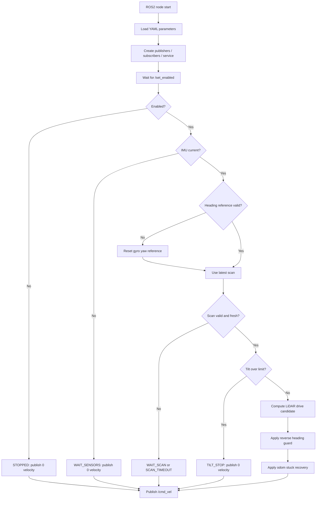
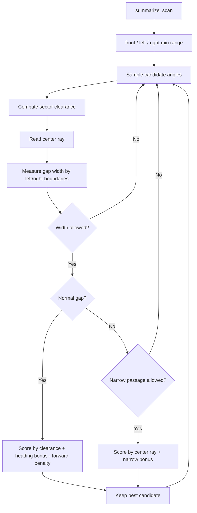

# Code Flow

이 문서는 [src/gap_drive_node.cpp](src/gap_drive_node.cpp)의 현재 동작 흐름을 설명합니다. 이 노드는 SLAM/Nav2 없이 `/scan`, `/imu`, `/odom`을 이용해 reactive gap drive를 수행하고, 여러 안전장치를 마지막 단계에서 속도 명령에 덮어씁니다.

## 전체 구조

```mermaid
flowchart TD
    A["ROS2 node start"] --> B["Load YAML parameters"]
    B --> C["Create publishers / subscribers / service"]
    C --> D["Wait for /set_enabled"]
    D --> E{"Enabled?"}
    E -- "No" --> F["STOPPED: publish 0 velocity"]
    E -- "Yes" --> G{"IMU current?"}
    G -- "No" --> H["WAIT_SENSORS: publish 0 velocity"]
    G -- "Yes" --> I{"Heading reference valid?"}
    I -- "No" --> J["Reset gyro yaw reference"]
    I -- "Yes" --> K["Use latest scan"]
    J --> K
    K --> L{"Scan valid and fresh?"}
    L -- "No" --> M["WAIT_SCAN or SCAN_TIMEOUT"]
    L -- "Yes" --> N{"Tilt over limit?"}
    N -- "Yes" --> O["TILT_STOP: publish 0 velocity"]
    N -- "No" --> P["Compute LiDAR drive candidate"]
    P --> Q["Apply reverse heading guard"]
    Q --> R["Apply odom stuck recovery"]
    R --> S["Publish /cmd_vel"]
    F --> S
    H --> S
    M --> S
    O --> S
```

## 입력과 상태 저장

1. `scan_callback`

   `/scan`의 최신 `LaserScan`과 수신 시간을 저장합니다. 제어 timer에서는 오래된 scan을 쓰지 않도록 `lost_scan_timeout_seconds`를 검사합니다.

2. `imu_callback`

   `/imu` orientation quaternion으로 roll/pitch를 계산해서 전복 정지에 사용합니다. `angular_velocity.z`는 gyro yaw로 적분하며, start 시점에 이 값을 0도로 reset합니다.

3. `odom_callback`

   `/odom`의 위치와 선속도를 저장합니다. 전진 명령이 있는데 위치 변화와 odom 속도가 거의 없으면 stuck 후보로 봅니다.

4. `set_enabled_callback`

   `/turtlebot_autonomous_gap_drive/set_enabled` 서비스로 주행을 켜고 끕니다. `data: true`이면 센서가 준비된 뒤 gyro yaw 기준을 reset하고, `data: false`이면 즉시 정지 상태로 전환합니다.

## 제어 Timer 흐름

`control_timer_callback`은 `control_period_ms`마다 실행됩니다. 대략적인 우선순위는 아래와 같습니다.

1. `STOPPED`: 서비스 start 전이면 0속도를 계속 publish합니다.
2. `WAIT_SENSORS`: IMU가 없거나 timeout이면 0속도입니다.
3. `TILT_STOP`: roll/pitch가 `tilt_stop_deg`를 넘으면 즉시 0속도입니다.
4. `WAIT_SCAN` / `SCAN_TIMEOUT`: scan이 없거나 오래되면 0속도입니다.
5. `compute_drive_output`: LiDAR 기반 기본 주행 명령을 계산합니다.
6. `apply_reverse_guard`: 기준 heading 반대 방향으로 전진 중이면 복구 회전을 덮어씁니다.
7. `apply_stuck_recovery`: odom상 진행이 없으면 후진/회전 복구 명령을 덮어씁니다.
8. `publish_velocity`: 최종 선택된 선속도/각속도를 publish합니다.

## LiDAR 후보 선택

```mermaid
flowchart TD
    A["summarize_scan"] --> B["front / left / right min range"]
    B --> C["Sample candidate angles"]
    C --> D["Compute sector clearance"]
    D --> E["Read center ray"]
    E --> F["Measure gap width by left/right boundaries"]
    F --> G{"Width allowed?"}
    G -- "No" --> C
    G -- "Yes" --> H{"Normal gap?"}
    H -- "Yes" --> I["Score by clearance + heading bonus - forward penalty"]
    H -- "No" --> J{"Narrow passage allowed?"}
    J -- "No" --> C
    J -- "Yes" --> K["Score by center ray + narrow bonus"]
    I --> L["Keep best candidate"]
    K --> L
    L --> C
```

일반 후보는 후보 방향 주변 `gap_window_deg` 안의 최소 거리가 `safe_gap_distance_m` 이상이어야 합니다. 이 방식은 보수적이지만, 작은 문틈 뒤에 대각선 벽이 있을 때 실제 통과 가능한 gap도 막힌 벽처럼 보일 수 있습니다.

이를 보완하기 위해 `NARROW_GAP_DRIVE` 후보를 별도로 둡니다. 중심 ray가 충분히 깊고, 양쪽 경계로 계산한 폭이 `min_passage_width_m` 이상이며, 중심 ray가 양쪽 경계보다 더 깊으면 `gap_window_deg`의 최소 거리가 낮아도 좁은 통로로 인정합니다.

## 주행 모드

- `STOPPED`: 서비스 start 전 또는 stop 요청 후 0속도입니다.
- `WAIT_SENSORS`: IMU 데이터가 없거나 timeout입니다.
- `WAIT_SCAN`: 아직 LiDAR scan을 받지 못했습니다.
- `SCAN_TIMEOUT`: 마지막 scan이 너무 오래되었습니다.
- `TILT_STOP`: IMU roll/pitch가 `tilt_stop_deg`를 넘었습니다.
- `GAP_DRIVE`: 일반 gap 후보를 따라 전진합니다.
- `NARROW_GAP_DRIVE`: 작은 gap 뒤 대각 벽 같은 구조에서 폭과 중심 ray 조건을 만족해 천천히 진입합니다.
- `WALL_ASSIST`: 좁은 양벽 구간에서 중앙 정렬 대신 가까운 벽과 목표 거리를 유지합니다.
- `BLOCKED_TURN`: 전방이 막혔거나 안전 후보가 없어 제자리 회전합니다.
- `EMERGENCY_TURN`: 전방 장애물이 매우 가까워 즉시 전진을 멈추고 회전합니다.
- `REVERSE_WARN`: 기준 heading 반대 방향으로 전진 중이지만 아직 hold 시간 전입니다.
- `REVERSE_RECOVERY`: 기준 heading 쪽으로 제자리 회전합니다.
- `STUCK_BACKUP`: 전진 명령이 있는데 odom상 진행이 없어 짧게 후진합니다.
- `STUCK_TURN`: 후진 후 더 여유 있는 방향으로 제자리 회전합니다.

## 속도 계산

기본 선속도는 `front_stop_distance_m`과 `front_slow_distance_m` 사이에서 점진적으로 증가합니다. 회전량이 커질수록 `turn_slowdown_gain`으로 선속도를 줄입니다. `NARROW_GAP_DRIVE`에서는 `narrow_passage_speed_m_s`가 전진 속도 상한으로 적용되어 작은 gap에 천천히 진입합니다.

기본 각속도는 아래 조합으로 계산합니다.

- `heading_cmd`: 선택된 후보 방향으로 회전하는 명령입니다.
- `centering_cmd`: 좌우 거리 차이를 줄여 중앙으로 가려는 명령입니다.
- `wall_assist_cmd`: wall assist가 활성화되면 `centering_cmd` 대신 사용됩니다.

## 회복과 덮어쓰기 순서

`compute_drive_output`이 만든 명령은 최종 명령이 아닙니다. 이후 안전장치가 같은 `DriveOutput`을 수정합니다.

1. LiDAR 기본 로직이 `GAP_DRIVE`, `NARROW_GAP_DRIVE`, `WALL_ASSIST`, `BLOCKED_TURN`, `EMERGENCY_TURN` 중 하나를 만듭니다.
2. `apply_reverse_guard`가 필요하면 `REVERSE_RECOVERY`로 선속도 0, 회전 명령을 덮어씁니다.
3. `apply_stuck_recovery`가 필요하면 `STUCK_BACKUP` 또는 `STUCK_TURN`으로 다시 덮어씁니다.

따라서 로그에서 어떤 모드가 보이는지는 마지막에 적용된 안전장치 기준입니다. 예를 들어 LiDAR상으로는 `NARROW_GAP_DRIVE` 후보가 선택되었더라도 odom stuck 조건이 만족되면 최종 로그는 `STUCK_BACKUP`이 됩니다.
